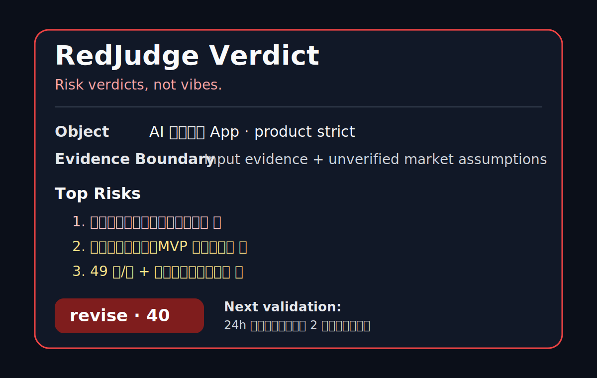

<div align="center">

# RedJudge

> *「Risk verdicts, not vibes. 先划证据边界，再给风险裁决。」*

[](SKILL.md)
[](https://github.com/gaoyechen/redjudge/actions/workflows/validate.yml)
[](LICENSE)
[](SKILL.md)

**RedJudge 把“帮我看看靠谱吗”变成一份 evidence-aware red-team verdict：先扫风险，再确认价值，最后给出 continue / revise / abandon 裁决。**

[看效果](#效果示例) · [快速开始](#快速开始) · [触发方式](#触发方式) · [安全边界](#安全边界) · [验证与测试](#验证与测试)

</div>

---



<sub>示例卡片来自 `examples/redjudge-result-card.md`。它是展示格式，不代表真实市场结论。</sub>

---

## 它解决什么问题

你让 AI “评价一下”，多数时候会得到温和、圆滑、看起来有帮助但不够刺痛的问题清单。RedJudge 反过来做：先划清证据边界，再找能让方案失败的风险，最后给出一个不能靠好听话糊过去的裁决。

它适合用在你准备投入更多时间、钱或声誉之前：做产品、写文章、定商业方向、评估计划、发布方案、改 PRD、判断一个想法是否值得继续。

RedJudge 不承诺“绝对客观”。它承诺的是：**不把假设当事实，不把角色扮演当证据，不把安慰当评审。**

---

## 效果示例

输入：

```text
/RedJudge product strict：我想做一个 AI 求职陪练 App，目标是 25-35 岁想转行互联网的人。
功能包括模拟面试、简历改写、岗位推荐和学习计划。定价 49 元/月。
先做微信小程序，靠小红书投流获客。你帮我判断靠不靠谱。
```

输出会包含：

```text
Evidence Boundary: 本评审只基于输入；CAC、竞品、招聘数据、小红书投流成本未核实。

Red Scan:
1. 目标用户过宽，核心场景不成立 🔴
2. MVP 同时塞入四个大功能，价值焦点被稀释 🟡
3. 差异化不足，容易变成通用 AI 包装层 🟡
...

Verdict: revise
Weighted total: 40
Highest-leverage change: 收窄到一个单点垂直 MVP，例如“转行产品经理的 AI 模拟面试 + 简历追问评分”。

Next Validation: 用 24 小时小红书测试验证是否有人愿意付 9.9 元定金。
```

完整展示见 [`examples/redjudge-result-card.md`](examples/redjudge-result-card.md)。

---

## 快速开始

从 GitHub 安装：

```bash
npx skills add gaoyechen/redjudge
```

如果你已经 clone 到本地仓库根目录，也可以本地安装：

```bash
npx skills add . --skill redjudge
```

装完后对 Agent 说：

```text
/RedJudge product strict：这是我的产品方案……帮我判断靠不靠谱，不要安慰我，先指出能让它失败的问题。
```

> 发布到 skills.sh 后，再把 skills.sh 安装计数徽章替换为真实地址。不要在发布前伪造安装计数。

---

## 触发方式

这些话应该触发 RedJudge：

- `/RedJudge idea：我有个想法，帮我判断值不值得做。`
- `/RedJudge article：评审这篇文章的论证。`
- `/RedJudge product strict：这个产品靠不靠谱？`
- `帮我挑毛病，不要只说好听的。`
- `red team this plan before I start building.`
- `这个方案有没有致命风险？`
- `我准备发这个公众号，先帮我做严格评审。`
- `这个商业计划是不是自嗨？`

这些话不应该触发 RedJudge：

- `帮我头脑风暴 20 个点子。`
- `只夸优点，不要批评。`
- `帮我润色语气。`
- `查一下今天某个产品的价格。`
- `直接把这个文件改掉。`

---

## 能做什么 / 它会交付什么

| 能力 | 交付物 | 典型用途 |
|---|---|---|
| Evidence Boundary | 明确哪些来自输入、哪些需要核实 | 防止把假设说成事实 |
| Red Scan | 3 个默认风险；strict 模式 5 个 | 先找失败点，不先安慰 |
| Multi-Perspective Review | 3-4 个匹配角色的异议 | 从用户、执行者、竞品、编辑等视角找盲点 |
| Value Confirmation | 只确认未被风险击穿的价值点 | 避免纯负面表演 |
| Verdict | continue / revise / abandon + weighted total | 给出可行动的判断 |
| Next Validation | 一个最高杠杆验证动作 | 让下一步不是泛泛建议 |

---

## 它和同类有什么不同

| 对象 | 常见做法 | RedJudge 的差异 |
|---|---|---|
| 普通 critique prompt | 直接列优缺点 | 先划 Evidence Boundary，再做 Red Scan |
| anti-sycophancy prompt | 反对迎合，但未必给裁决 | RedJudge 必须给 continue / revise / abandon |
| code review skill | 聚焦 PR、代码、架构 | RedJudge 覆盖 idea / article / product / plan / draft |
| 多代理 tribunal | 重流程、多 reviewer | RedJudge 默认单轮轻量，strict 时再提高强度 |
| LLM eval framework | 适合系统化 benchmark | RedJudge 是人类决策前的轻量评审协议 |

参考同行与打磨记录见 [`references/luban-audit-2026-06-13.md`](references/luban-audit-2026-06-13.md)。

---

## 安全边界

RedJudge 默认只做评审，不执行外部动作：

- 不会自动修改文件、提交代码、发布内容、发消息或调用付费 API。
- 不会把未核实的市场、法律、医疗、金融、安全事实当作结论。
- 不会为了显得严厉而编造风险。
- 不会在用户只要正面反馈时偷偷运行红队评审。
- 高风险、时效性、事实依赖强的判断必须核实；无法核实时标成 `Unverified Assumption`。

---

## 文件结构

```text
redjudge/
├── SKILL.md                         # Agent-facing RedJudge protocol
├── README.md                        # Public landing page and usage guide
├── LICENSE                          # MIT license
├── assets/
│   └── redjudge-result-card.svg      # Static showcase card
├── evals/
│   └── evals.json                    # Regression prompts and expectations
├── examples/
│   ├── article-review.md             # Style example
│   ├── idea-review.md                # Style example
│   ├── product-review.md             # Style example
│   └── redjudge-result-card.md       # Screenshot-friendly result card
├── references/
│   ├── anti-sycophancy-rules.md
│   ├── dimension-templates.md
│   ├── luban-audit-2026-06-13.md
│   └── verdict-rubric.md
└── scripts/
    ├── check-redjudge-evals.py       # Package/eval validator
    └── check-redjudge-evals.sh       # Shell wrapper
```

---

## 验证与测试

运行静态验证：

```bash
python scripts/check-redjudge-evals.py
```

或：

```bash
bash scripts/check-redjudge-evals.sh
```

代表性测试用例在 [`evals/evals.json`](evals/evals.json)。它们覆盖：

1. product strict：必须给 5 个 evidence-backed risks；
2. article：必须把未核实外部事实标成假设；
3. vague input：必须先索要上下文；
4. quick mode：必须输出压缩版，不跑完整长评审；
5. positive-only near miss：必须拒绝把 RedJudge 用成夸奖工具。

---

## 发布前清单

- [x] `SKILL.md` 有强触发 description。
- [x] README 有钩子、示例、安装、触发方式、安全边界、验证方式。
- [x] `LICENSE` 已补。
- [x] `evals/evals.json` 已补。
- [x] 可截图结果卡已补。
- [x] GitHub 安装命令已替换为 `gaoyechen/redjudge`。
- [ ] 发布到 skills.sh 后，加真实徽章，不用占位徽章冒充计数。
- [ ] 如目标是 ClawHub / Claude plugin marketplace，再补对应 manifest。

---

## License

[MIT](LICENSE)

---

<div align="center">

*先划证据边界，再给风险裁决。*

</div>
